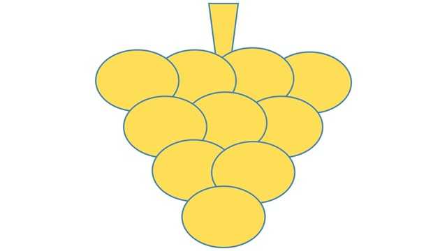
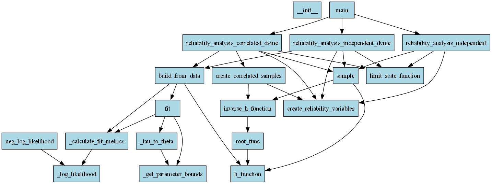
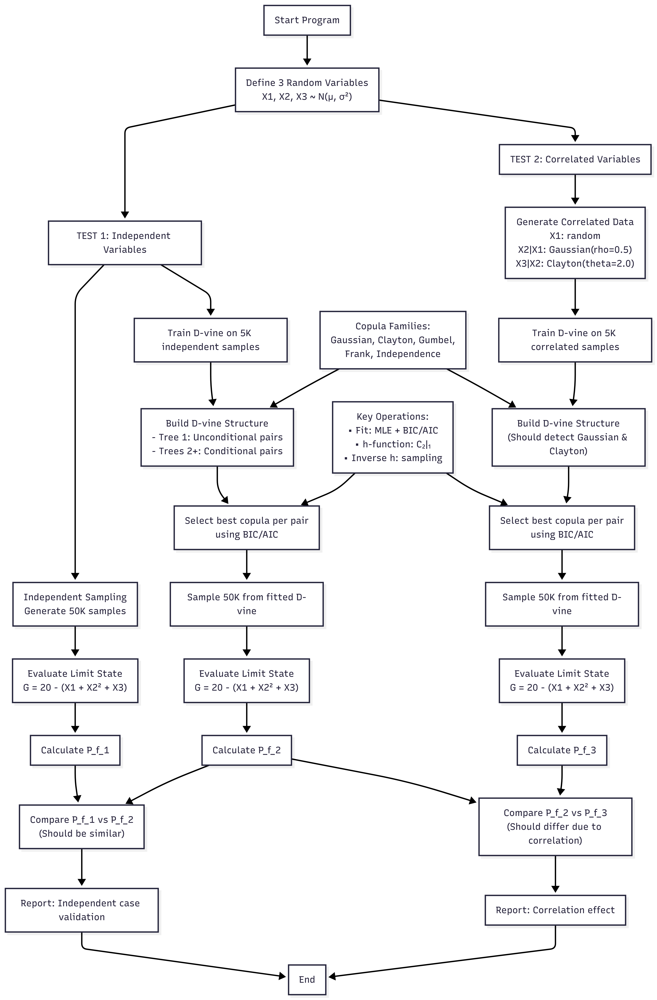

## D-vine copula algorithm for reliability analysis



This Python code implements a D-vine copula framework for reliability analysis with applications in risk assessment and structural safety engineering. The system models complex dependencies between random variables when estimating failure probabilities. Compared to the traditional Monte Carlo simulation, which relies on large-scale repeated sampling, the D-vine Copula method significantly reduces computational complexity through analytical derivation, improving computational efficiency.
Core implementation features:
* Five copula families (Gaussian, Clayton, Gumbel, Frank, Independence) to capture different dependency patterns
* Automatic model selection using BIC/AIC criteria to identify the best-fitting copula for each variable pair
* Hierarchical D-vine construction that builds conditional dependency trees from data
* Conditional sampling algorithm for generating correlated samples from the fitted vine structure

In reference [1] the vine model, for dependent random variables was first introduced. D-vines correspond to the vines shown in Figures 2 and 10 of the same reference ([1]). Example 4 of reference [1] is also worth studying. The present implementation is best illustrated in reference [2] where Figure 1 shows a D-vine with 5 variables, 4 trees and 10 edges, where each edge may be associated with a pair-copula. Section 4.2 and Algorithm 2 of the same reference ([2]) show how sampling from a D-vine is performed. The sequential tree-by-tree selection, use of BIC/AIC measures for copula family selection and h-function recursion for conditioning used in the present code are presented in reference [3]. 

The code demonstrates how to estimate failure probabilities for a simple limit state function. Traditional reliability methods often assume independence between variables, but real-world systems frequently exhibit complex dependencies. For example, in a building structure, material strength, load conditions and environmental factors may be correlated. This implementation captures these dependencies through copulas, providing more accurate risk estimates.

Key applications of the present algorithm include, but are not limited to the following:
* Structural safety assessment - estimation of probability of structural failure under correlated loads
* Financial risk modeling - portfolio risk analysis with dependent asset returns
* Environmental engineering - flood risk assessment with correlated rainfall and soil parameters
* Mechanical systems - reliability of components with interdependent failure modes

This code reveals how dependencies can significantly affect failure probabilities. In the test case, correlated variables produce higher probability of failure than independent variables, highlighting why dependency modeling is crucial for accurate risk assessment. This approach is particularly valuable in structural engineering, insurance, finance and any domain where underestimating correlated risks could have severe consequences.

This framework's flexibility allows extension to more complex systems with additional variables and different limit state functions, making it a versatile tool for probabilistic risk analysis across engineering disciplines.

## Prerequisites

* The following Python packages are required:

1. numpy
2. scipy

* The following Python modules are required:

1. dataclasses
2. enum
3. typing

## Quick Start

* Clone or download the repository
* Open the project directory in VS Code or other Integrated Development Environment (IDE)
* Run the main script (main.py)

## Dependency graph



## Algorithm diagram



## Algorithm Flowchart

``` 
Start
  ↓
Define CopulaFamily Class (Copula families)
  ├── GAUSSIAN
  ├── CLAYTON
  ├── GUMBEL
  ├── FRANK
  ├── INDEPENDENCE (product copula)
  ↓
Define PairCopula Class
  └── Attributes:
      ├── family: CopulaFamily
      ├── theta: scalar parameter defining copula families
      ├── log_likelihood, AIC, BIC: Fit metrics
  └── Core Methods:
      └── fit(u1, u2): estimation of parameters using Maximum Likelihood Estimation (MLE)
          ├── If CopulaFamily=INDEPENDENCE → theta = 0
          └── Else:
              ├── Compute Kendall's tau
              ├── Compute theta from Kendall's tau for initial guess
              ├── Define negative log-likelihood function (equal to -_log_likelihood, see below)
              ├── Bounded optimization (find theta such that neg_log_likelihood is minimized)
              ├── Fallback to CopulaFamily=INDEPENDENCE if optimization fails
      └── _log_likelihood(theta, u1, u2): CopulaFamily-specific
          ├── GAUSSIAN: Multivariate normal distribution
          ├── CLAYTON: Archimedean, capturing asymmetry with lower tail dependence
          ├── GUMBEL: Archimedean, capturing asymmetry in the upper tails
          ├── FRANK: Archimedean, capturing positive and negative dependencies symmetrically
          ├── INDEPENDENCE: Returns 0
      └── _calculate_fit_metrics(u1, u2):
          ├── Compute LL (log-likelihood)
          ├── Define k (0 if CopulaFamily=INDEPENDENCE, 1 otherwise)
          ├── AIC = 2*k - 2*LL (k=1 parameter)
          ├── BIC = k*log(n) - 2*LL (n is the length of u1)
      └── _tau_to_theta(tau): convert Kendall's tau to initial parameter guess (theta)
          ├── GAUSSIAN: theta = sin(π*tau/2)
          ├── CLAYTON: theta = 2*tau/(1-tau) for tau>0
          ├── GUMBEL: theta = 1/(1-tau) for tau>0
          ├── FRANK: theta = 9*tau (approximate relationship)
      └── _get_parameter_bounds():
          ├── GAUSSIAN: (-0.99, 0.99)
          ├── CLAYTON: (0.001, 20.0)
          ├── GUMBEL: (1.001, 20.0)
          ├── FRANK: (-30.0, 30.0)
          ├── INDEPENDENCE: (0.0,0.0)
      └── h_function(u1, u2): Conditional CDF C_{2|1}
          ├── INDEPENDENCE: returns u2
          ├── Clip u1, u2 between 1e-10 and 1-1e-10 (u1_clip, u2_clip respectively)
          ├── GAUSSIAN: Closed-form using u1_clip, u2_clip
          ├── CLAYTON: Closed-form using u1_clip, u2_clip
          ├── GUMBEL: Closed-form using u1_clip, u2_clip
          ├── FRANK: Closed-form using u1_clip, u2_clip
      └── inverse_h_function(u1, v): Inverse for sampling
          ├── INDEPENDENCE: returns v
          ├── Clip u1, v between 1e-10 and 1-1e-10 (u1_clip, v_clip respectively)
          ├── GAUSSIAN: Closed-form using u1_clip, v_clip
          ├── CLAYTON: Closed-form using u1_clip, v_clip
          ├── GUMBEL: Numerical root-finding (brentq) using u1_clip, v_clip
          ├── FRANK: Numerical root-finding (brentq) using u1_clip, v_clip
  ↓
Define DVineStructure Class
  └── Attributes:
      ├── order: Variable ordering (list of names)
      ├── n_vars: Number of variables
      ├── trees: List of dictionaries per tree level
      ├── vine_array: Triangular matrix of PairCopula objects
  └── Core Methods:
      └── build_from_data(data, families):
          ├── Input: data (n_samples x n_vars)
          ├── Transform to uniforms via empirical CDF
          ├── Initialize vine_array (n_vars x n_vars)
          └── For each adjacent pair (i, i+1): Tree 1, unconditional pairs
              ├── Try all families, fit parameters
              ├── Select best by BIC
              ├── Check if near independence
              ├── Store in vine_array[i, i+1]
          └── For tree_level = 2 to n_vars-1: Higher trees, conditional pairs
              └── For each pair (i, j=i+tree_level):
                  └── For k = i+1 to j-1: Apply conditioning via h-functions
                      ├── Get copula from previous tree
                      ├── Apply h-function recursively
                  ├── Try all families on conditioned samples
                  ├── Select best copula (best_copula) by BIC
                  ├── If near-independence: best_copula=INDEPENDENCE
                  ├── Store best_copula in vine_array[i, j]
                  ├── Print tree-by-tree progress
      └── sample(n, rng): Generate samples
          ├── Initialize samples matrix (n x n_vars)
          ├── Sample U1 ~ Uniform(0,1)
          └── For j = 1 to n_vars-1:
              ├── V ~ Uniform(0,1)
              └── For i = 0 to j-1:
                  ├── u_cond = samples[:, i]
				  ├── Find conditioned version of u_cond given i+1 to j-1 intermediate variables:
                  └── For k = i to j-2:
                      ├── u_cond = h_function(samples[:, k+1], u_cond) using copula (k,k+1): 
				  ├── u_cond is U_i | i+1,...,j-1
                  ├── V = inverse_h_function(u_cond,V) using copula(i,j)
              ├── samples[:, j] = V
  ↓
Define reliability analysis functions
  ├── RandomVariable dataclass: name, mean, std
  └── create_reliability_variables()
      ├── Create 3 normal RVs with different mean and std
  └── create_correlated_samples(n_samples): Test data generation
      ├── X1: Normal RV
      ├── X2 | X1: Gaussian copula (rho=0.5)
      ├── X3 | X2: Clayton copula (theta=2.0)
      ├── Transform X1, X2, X3 to physical space
  └── limit_state_function(x1, x2, x3, threshold):
      ├── G = threshold - (x1 + x2^2 + x3)
  └── reliability_analysis_independent(n_samples,threshold):
      ├── Perform reliability analysis using independent sampling
      ├── create_reliability_variables()
      ├── Sample n_samples points independently
      ├── Evaluate limit state
      ├── Calculate confidence interval
  └── reliability_analysis_independent_dvine(n_samples,n_train,threshold):
      ├── Perform reliability analysis using D-vine copula on independent data
      ├── create_reliability_variables()
      ├── Generate n_train training samples for D-vine fitting independently
      ├── Build D-vine
      ├── Sample n_samples points from D-vine
      ├── Transform back to physical space
      ├── Evaluate limit state
      ├── Calculate confidence interval
  └── reliability_analysis_correlated_dvine(n_samples,threshold)
      ├── Perform reliability analysis using D-vine copula on correlated data
      ├── create_reliability_variables()
      ├── Generate n_train training samples for D-vine fitting using create_correlated_samples(n_train)
      ├── Build D-vine
      ├── Sample n_samples points from D-vine
      ├── Transform back to physical space
      ├── Evaluate limit state
      ├── Calculate confidence interval
  ↓
Main Execution Flow
  └── TEST 1: Independent Variables
      ├── pf_indep = reliability_analysis_independent(50000, 20.0)
      ├── pf_dvine_indep = reliability_analysis_independent_dvine(50000, 5000, 20.0)
      ├── Compare pf_dvine_indep to pf_indep
  └── TEST 2: Correlated Variables
      ├── pf_dvine_corr = reliability_analysis_correlated_dvine(50000, 5000, 20.0)
      ├── Compare pf_dvine_corr to pf_indep
  ↓
End
```

## Results

```
============================================================
RELIABILITY ANALYSIS DEMONSTRATION
============================================================

============================================================
TEST 1: INDEPENDENT VARIABLES
============================================================

RELIABILITY ANALYSIS USING INDEPENDENT SAMPLING

Random Variables:
  X1: N(2.0, 0.4²)
  X2: N(3.0, 0.6²)
  X3: N(1.5, 0.3²)

Limit state: G = 20.0 - f(X1 , X2 , X3)
Failure when: f(X1 , X2 , X3) >= 20.0

Sampling 50000 points independently...

Results:
  Samples: 50,000
  Failures: 1969
  Failure probability: 0.039380
  95% Confidence interval: [0.037675, 0.041085]
  CoV of estimate: 0.0221

RELIABILITY ANALYSIS USING D-VINE COPULA ON INDEPENDENT DATA

Random Variables:
  X1: N(2.0, 0.4²)
  X2: N(3.0, 0.6²)
  X3: N(1.5, 0.3²)

Limit state: G = 20.0 - f(X1 , X2 , X3)
Failure when: f(X1 , X2 , X3) >= 20.0

Generating 5000 training samples...

Building D-vine structure...

Tree 1 (unconditional pairs):
  Pair (X1, X2): gaussian, θ=-0.033, BIC=2.9
  Pair (X2, X3): gaussian, θ=0.015, BIC=7.4

Tree 2 (conditional pairs):
  Pair (X1, X3): gaussian, θ=-0.017, BIC=7.0

Sampling 50000 points from D-vine...

Results:
  Samples: 50,000
  Failures: 1961
  Failure probability: 0.039220
  95% Confidence interval: [0.037518, 0.040922]
  CoV of estimate: 0.0221

COMPARISON (Independent Variables):
Independent sampling: pf = 0.039380
D-vine copula:        pf = 0.039220
Difference:           0.000160
OK: Results match (within tolerance)

============================================================
TEST 2: CORRELATED VARIABLES
============================================================

RELIABILITY ANALYSIS USING D-VINE COPULA ON CORRELATED DATA

Random Variables (marginals):
  X1: N(2.0, 0.4²)
  X2: N(3.0, 0.6²)
  X3: N(1.5, 0.3²)

Known correlations:
  X1: Normal RV
  X2|X1: Gaussian copula (rho=0.5)
  X3|X2: Clayton copula (theta=2.0)

Limit state: G = 20.0 - f(X1 , X2 , X3)
Failure when: f(X1 , X2 , X3) >= 20.0

Generating 5000 training samples with known correlations...

Building D-vine structure...

Tree 1 (unconditional pairs):
  Pair (X1, X2): gaussian, θ=0.507, BIC=-1467.8
  Pair (X2, X3): clayton, θ=1.268, BIC=-2615.5

Tree 2 (conditional pairs):
  Pair (X1, X3): gaussian, θ=-0.453, BIC=-1132.6

Sampling 50000 points from fitted D-vine...

Results:
  Samples: 50,000
  Failures: 2462
  Failure probability: 0.049240
  95% Confidence interval: [0.047343, 0.051137]
  CoV of estimate: 0.0197

COMPARISON (Correlated vs Independent):
Independent variables: pf = 0.039380
Correlated variables:  pf = 0.049240
Difference:            0.009860
OK: Correlation affects failure probability (as expected)
```

## License
See LICENSE.

## Contributing
We welcome contributions! Please see CONTRIBUTING for guidelines. Check how D-vine copula algorithm is applied for seismic reliability analysis in reference [4] for example.

## Support
For questions, issues, or feature requests either open an issue on GitHub Issues or contact me directly through email at gpapazafeiropoulos@yahoo.gr

## References

1. **Vine model for dependent random variables**

Bedford, T., & Cooke, R. M. (2002). Vines-a new graphical model for dependent random variables. The Annals of statistics, 30(4), 1031-1068.

2. **Tail dependence modelled using cascades of pair-copulae**

Aas, K., Czado, C., Frigessi, A., & Bakken, H. (2009). Pair-copula constructions of multiple dependence. Insurance: Mathematics and economics, 44(2), 182-198.

3. **Sequential tree-by-tree selection, BIC/AIC for copula family selection and h-function recursion for conditioning** 

Dissmann, J., Brechmann, E. C., Czado, C., & Kurowicka, D. (2013). Selecting and estimating regular vine copulae and application to financial returns. Computational Statistics & Data Analysis, 59, 52-69.

4. **Application of D-vine copula for seismic reliability analysis** 

Liu, J., Zhang, J., Zhang, H., Ye, H., & Wang, X. (2025). Seismic Reliability Analysis of Reinforced Concrete Arch Bridges Considering Component Correlation. Buildings, 15(24), 4442.
